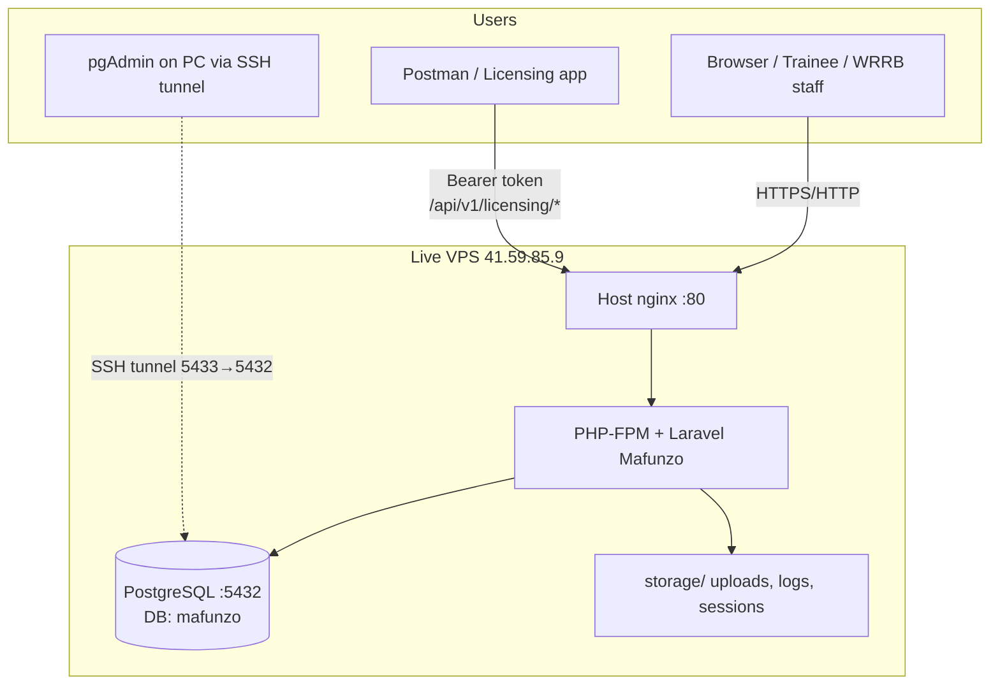
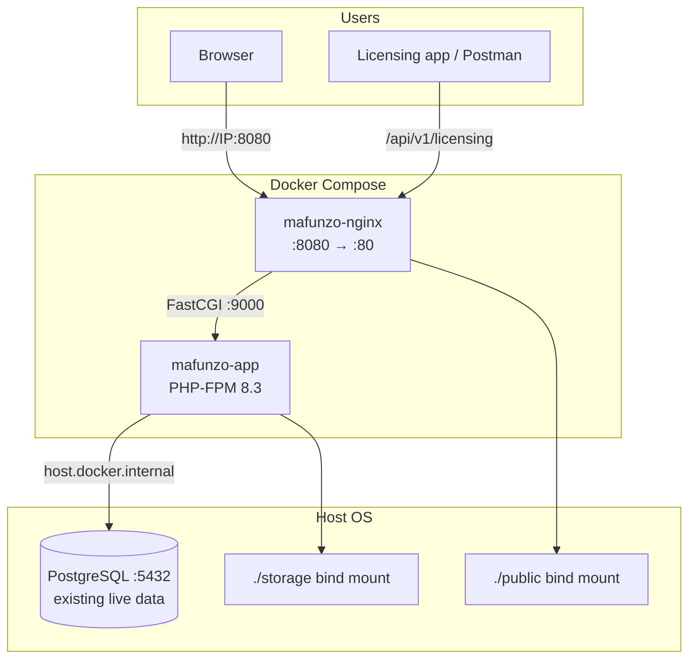
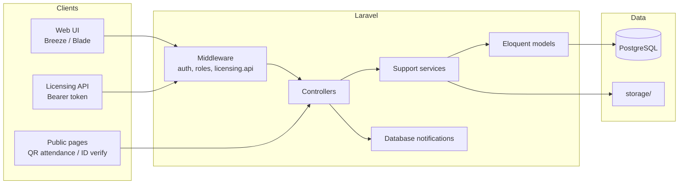
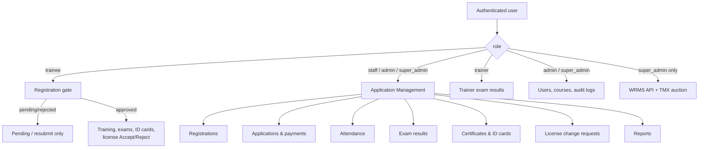
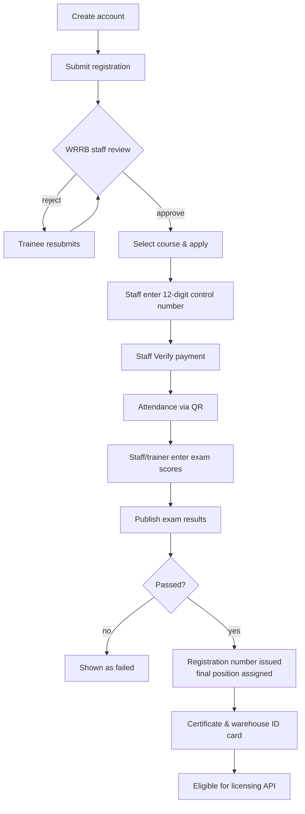
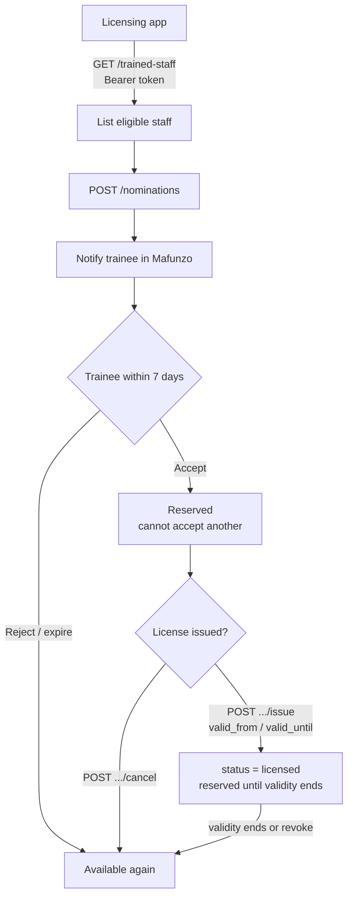
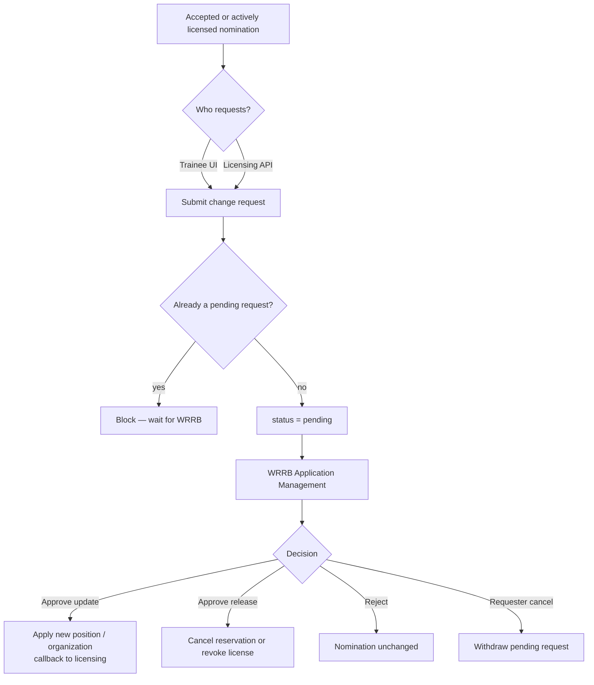
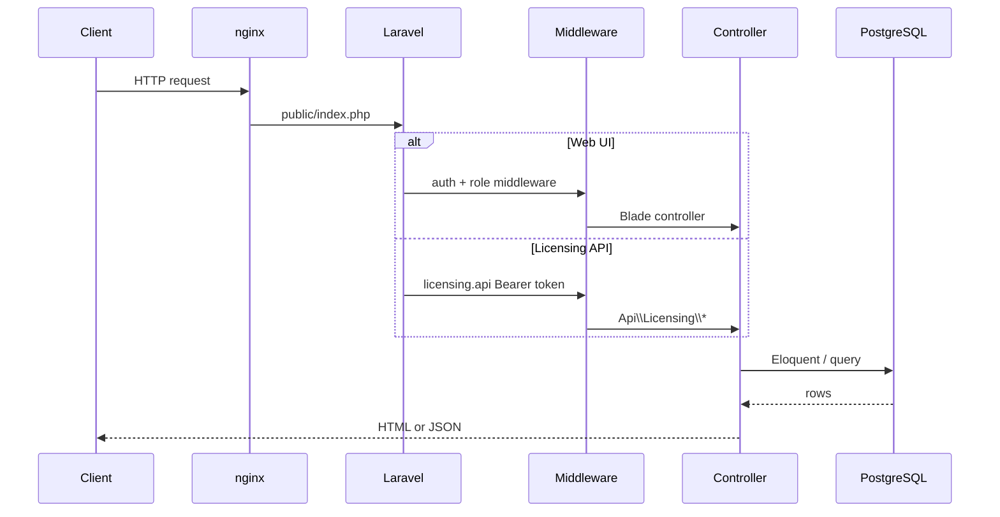
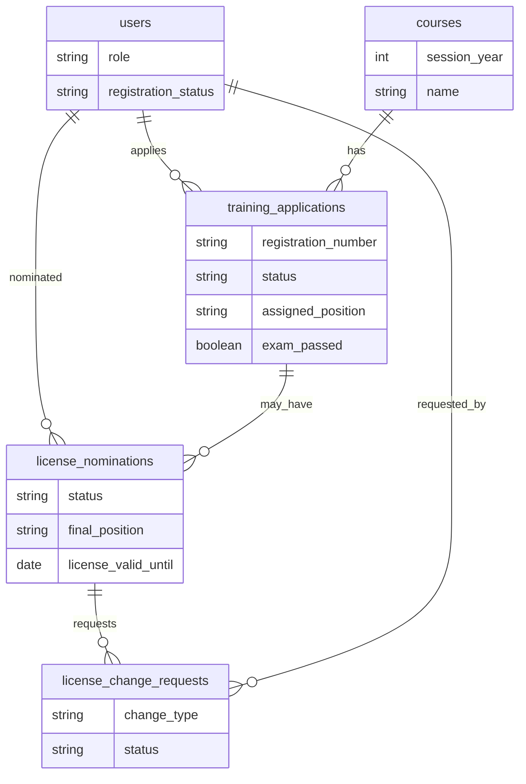

# Mafunzo architecture & flowcharts

WRRB training system (Laravel 12 + PostgreSQL).  
Live: `http://41.59.85.9`

This document covers:

1. Current live deployment  
2. Docker Phase 1 (planned cutover)  
3. Application / module architecture  
4. Roles & access  
5. Trainee lifecycle flowchart  
6. Licensing integration flowchart  
7. License change-request flowchart  

---

## 1. Current live deployment

Host PHP + host nginx + host PostgreSQL on one Ubuntu VPS.



| Layer | Technology |
|--------|------------|
| Web | nginx |
| App | Laravel 12, PHP 8.2+ |
| DB | PostgreSQL (`mafunzo` / `mafunzo_user`) |
| Cache / session / queue | `file` / `file` / `sync` (no Redis yet) |
| Integrations | Licensing API (Bearer), optional WRMS / TMX (super admin) |

---

## 2. Docker Phase 1 (safe target)

**In Docker:** nginx + PHP-FPM app.  
**On host (unchanged):** PostgreSQL.  
**Test port:** `:8080` while current site stays on `:80`.



Rollback: `docker compose down` → start host nginx again.

---

## 3. Application architecture



### Main modules

| Module | Purpose |
|--------|---------|
| Auth & registration | Sign up, WRRB approve/reject, resubmit |
| Courses | Create / publish training sessions |
| Training applications | Apply, control number, verify payment |
| Attendance | QR sessions + public scan |
| Exams | Upload scores, publish results, assign final position |
| Certificates | Generate / issue PDF certificates |
| Identity cards | Generate, publish, verify, revoke |
| Reports | Trained users export |
| Licensing API | Trained staff list, nominations, issue, change requests |
| Audit trail | Admin/super-admin activity log |
| WRMS / TMX | Super-admin data views |

---

## 4. Roles & access



| Role | Typical access |
|------|----------------|
| `trainee` | Own registration, apply for courses, view results/IDs, respond to license nominations |
| `staff` | Application Management (ops) |
| `trainer` | Exam results portal |
| `admin` | Ops + users + courses + audit |
| `super_admin` | Everything including WRMS/TMX |

---

## 5. Trainee lifecycle flowchart

End-to-end path from sign-up to licensed warehouse staff.



### Exam final-position rules (summary)

| Applied / rule | Pass condition | Else |
|----------------|----------------|------|
| Score ≥ 50 | Exam passed | Fail |
| Manager | Degree + score ≥ 70 | Fallback group* |
| Quality Assurance | Agriculture diploma + score ≥ 60 | Fallback group* |
| Field | `assigned_position` if set | — |

\*Fallback group: Documentation / Weight Assistant / Store Keeper.

---

## 6. Licensing integration flowchart

Licensing application ↔ Mafunzo.



### Nomination statuses

```text
pending → accepted → licensed
   │          │          │
   │          │          └─ revoked
   │          └─ cancelled
   ├─ rejected
   └─ expired (7-day window)
```

### API surface

| Method | Path |
|--------|------|
| GET | `/api/v1/licensing/trained-staff` |
| POST | `/api/v1/licensing/nominations` |
| GET | `/api/v1/licensing/nominations/{id}` |
| POST | `/api/v1/licensing/nominations/{id}/issue` |
| POST | `/api/v1/licensing/nominations/{id}/cancel` |
| POST | `/api/v1/licensing/nominations/{id}/change-requests` |

Auth: `Authorization: Bearer LICENSING_API_TOKEN`

---

## 7. License change-request flowchart

Staff or company may request a position/org change or early release. **WRRB approval required.**



Change types: `update` (position and/or organization) · `release` (leave company).

---

## 8. Request path inside Laravel (web vs API)



---

## 9. Key data entities



---

## Related docs

- [Licensing API](LICENSING_API.md) — endpoint contract for the licensing team  
- [Docker Phase 1 deploy](DOCKER_DEPLOY.md) — safe cutover on the live VPS  
