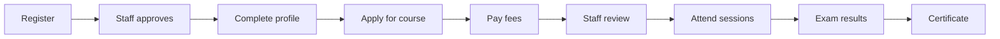
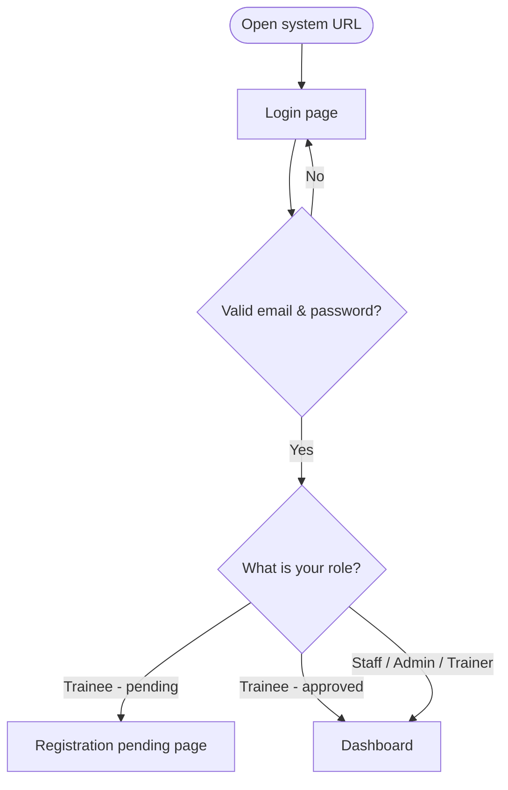
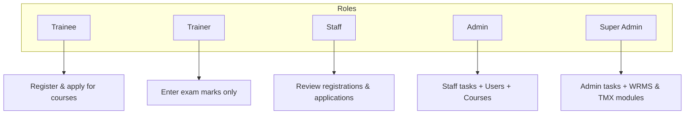
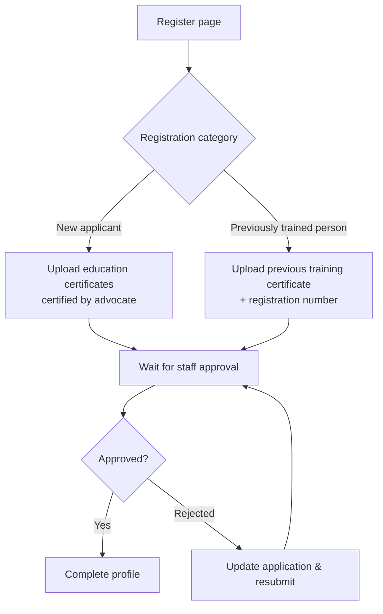
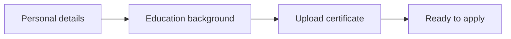
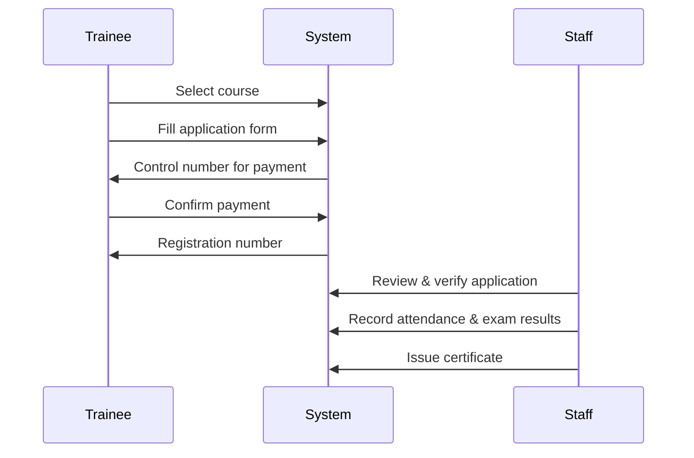
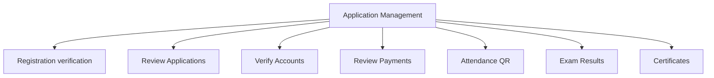
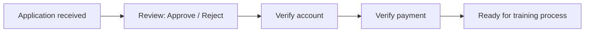
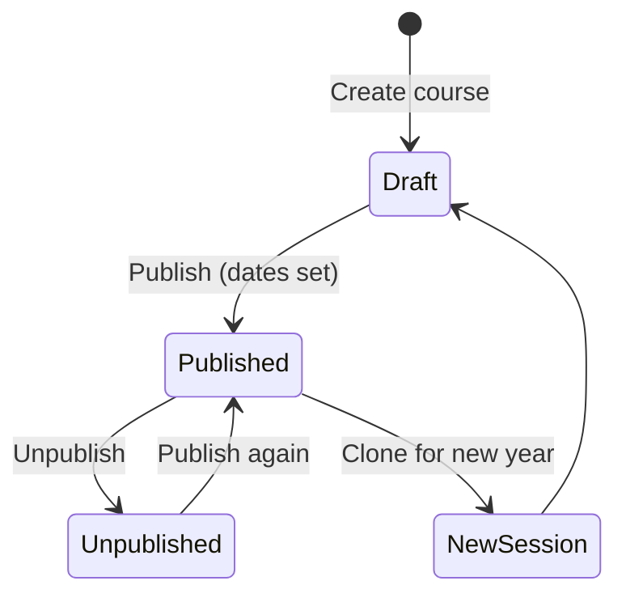
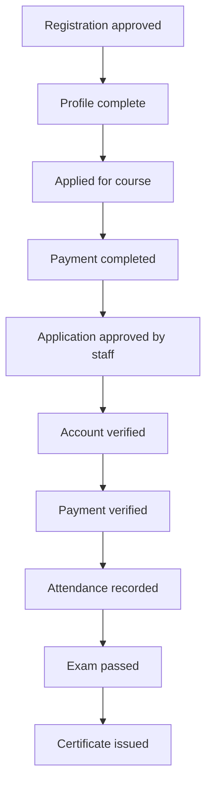

# Mafunzo System — User Training Guide

**Warehouse Receipt Regulatory Board (WRRB)**  
Training management platform for course registration, applications, attendance, examinations, and certificates.

Use this document to train staff, trainees, trainers, and administrators on how to use Mafunzo.

---

## Table of contents

1. [What is Mafunzo?](#1-what-is-mafunzo)
2. [How to sign in](#2-how-to-sign-in)
3. [User roles](#3-user-roles)
4. [Trainee guide](#4-trainee-guide)
5. [Staff guide](#5-staff-guide)
6. [Admin guide](#6-admin-guide)
7. [Trainer guide](#7-trainer-guide)
8. [Status reference](#8-status-reference)
9. [Common problems](#9-common-problems)
10. [Suggested training session agenda](#10-suggested-training-session-agenda)

---

## 1. What is Mafunzo?

Mafunzo helps WRRB manage the full training lifecycle:

| Stage | Who does it | Where in the system |
|-------|-------------|---------------------|
| Account registration | Trainee | **Register** page |
| Registration approval | Staff | **Application Management → Registration verification** |
| Profile & education | Trainee | **My profile** |
| Course application | Trainee | **Apply for Training** |
| Payment | Trainee (+ staff verify) | **Payment** page |
| Application review | Staff | **Application Management → Review Applications** |
| Attendance | Trainee scans QR | **Attendance (QR)** |
| Exam marks | Staff or Trainer | **Exam Results** / **Examination marks** |
| Certificate | Staff | **Application Management → Certificates** |

---

## 2. How to sign in

1. Open the system URL provided by your administrator (e.g. `http://your-server-address`).
2. You land on the **Login** page.
3. Enter your **email** and **password**.
4. Click **Log in**.

**Forgot password?** Use **Forgot your password?** on the login page to reset via email (if configured).

**New trainee?** Click **Register** on the login page. Each email can register **once only**.

---

## 3. User roles

Five roles exist in Mafunzo. Each person sees only the menus they need.

| Role | Main menu items | Main tasks |
|------|-----------------|------------|
| **Trainee** | Dashboard, My profile, Apply for Training, My Applications, Exam results | Register, complete profile, apply, pay, view results |
| **Trainer** | Dashboard, Examination marks | Enter exam scores and pass/fail for a course |
| **Staff** | Dashboard, Application Management | Verify registrations, review applications, attendance, exams, certificates |
| **Admin** | Dashboard, User Management, Course Management, Application Management | Everything Staff can do, plus manage users and courses |
| **Super Admin** | Same as Admin (+ hidden WRMS/TMX routes) | Full system access including integration modules |

---

## 4. Trainee guide

### 4.1 Choose your registration type

When you **Register**, pick one category:

| Category | Who should choose it | What you provide |
|----------|----------------------|------------------|
| **New applicant** | First-time WRRB trainee | Personal details + one or more education backgrounds with certificate uploads |
| **Previously trained person** | Already trained by WRRB before | Previous course, year, registration number, training certificate |

After registration you see **Registration pending verification** until staff approve your account.

### 4.2 Complete your profile

Once approved, go to **My profile** (or **Complete my profile** on the dashboard).

You must add:
- Full name, email, phone, region, district
- Company or private, gender, date of birth, position
- At least **one education background** with a certificate file (PDF, JPG, or PNG)

### 4.3 Apply for a training course

**Step-by-step:**

1. **Apply for Training** → choose an open course.
2. Fill in the application form (some fields come from your profile).
3. On the **Payment** page, note your **control number** and pay through the official WRRB payment channel.
4. After paying, click **Confirm payment**.
5. On the **Confirmation** page, save your **registration number** (format: `WRRB/YEAR/1/XXXX`).

Track progress anytime via **My Applications**.

### 4.4 Attendance (QR scan)

Staff create an attendance session and display a QR code.

1. Scan the QR code (or open the scan link).
2. Enter your **registration number**.
3. Submit — attendance is recorded if the number matches the course session.

> You do **not** need to be logged in to scan attendance.

### 4.5 View exam results

After staff or a trainer publish results:

- Go to **My examination results** (dashboard quick link or top menu).
- **Published results** — score and pass/fail shown.
- **Awaiting results** — exam not yet uploaded.

### 4.6 If registration is rejected

1. Read the **rejection reason** on the dashboard.
2. Click **Update application**.
3. Correct the information and resubmit.
4. Status returns to **pending** — wait for staff to review again.

---

## 5. Staff guide

Staff use **Application Management** as the main hub.

### 5.1 Registration verification

**Path:** Application Management → **Registration verification**

| Action | When to use |
|--------|-------------|
| **View** | Open applicant details, education, certificates |
| **Approve** | Information is complete and valid |
| **Reject** | Information is wrong or incomplete — always add a reason |

**Previously trained persons:** On approval, the system may auto-complete their legacy application (payment, exam passed, certificate).

### 5.2 Review applications

**Path:** Application Management → **Review Applications**

For each paid application, staff typically complete **three checks**:

Open an application → use buttons on the detail page:
- **Approve / Reject** application
- **Verify account**
- **Verify payment**

### 5.3 Attendance (QR)

**Path:** Application Management → **Attendance (QR)**

1. **Create session** — select course, session name, date.
2. Open the session → view **QR code** or scan link.
3. Display QR for trainees to scan.
4. View the list of scanned attendance records on the session page.

### 5.4 Exam results

**Path:** Application Management → **Exam Results**

1. Select a **course**.
2. Enter **score (0–100)** and **Passed: Yes/No** for each trainee.
3. Click **Save exam results**.

Trainees see results under **My examination results** once saved.

### 5.5 Certificates

**Path:** Application Management → **Certificates**

A trainee is eligible when:
- Application is **approved**
- Account and payment are **verified**
- Exam result is **passed**

Open the eligible trainee → **Issue certificate**.

---

## 6. Admin guide

Admins have everything Staff has, plus **User Management** and **Course Management**.

### 6.1 User Management

**Path:** Dashboard → **User Management**

| Task | Steps |
|------|-------|
| Create user | **Add user** → name, email, role, password |
| Edit user | Open user → change details or role |
| Delete user | Only if allowed (cannot delete yourself or higher-level admins) |

**Roles an Admin can assign:** Trainer, Staff, Trainee  
**Super Admin can also assign:** Admin, Super Admin

### 6.2 Course Management

**Path:** Dashboard → **Course Management**

| Task | Description |
|------|-------------|
| **Create course** | Name, code, session year, description, application dates |
| **Publish** | Makes course visible to trainees (requires valid dates) |
| **Unpublish** | Closes applications |
| **New session** | Copy course to a new session year (starts unpublished) |

**Application window states:**

| Status | Meaning for trainees |
|--------|----------------------|
| Unpublished | Course hidden — cannot apply |
| Upcoming | Dates set but not yet open |
| Open | Trainees can apply now |
| Closed | Deadline passed — cannot apply |

---

## 7. Trainer guide

Trainers have a **limited role** — they enter examination marks only.

**Path:** Dashboard → **Examination marks** (or top menu **Examination marks**)

1. Select a **course**.
2. Enter **score** and **pass/fail** for each trainee.
3. Click **Save exam results**.

> Trainers cannot review registrations, applications, or issue certificates.

---

## 8. Status reference

### Registration status (trainee account)

| Status | Meaning | What the trainee sees |
|--------|---------|------------------------|
| **Pending** | Waiting for staff | Cannot apply for courses yet |
| **Approved** | Account accepted | Full trainee access |
| **Rejected** | Not accepted | Rejection reason + option to update and resubmit |

### Application status (course application)

| Status | Meaning |
|--------|---------|
| **Pending payment** | Applied; control number issued; payment not confirmed |
| **Payment completed** | Trainee confirmed payment; registration number assigned |

### Application review status

| Status | Meaning |
|--------|---------|
| **Pending** | Staff have not approved/rejected yet |
| **Approved** | Application accepted |
| **Rejected** | Application rejected |

### End-to-end trainee checklist

---

## 9. Common problems

| Problem | Likely cause | What to do |
|---------|--------------|------------|
| Cannot apply for training | Registration not approved | Wait for staff or check registration status |
| Cannot apply for training | Profile incomplete | Complete **My profile** with education + certificate |
| Email already registered | Same email used before | Use **Login** instead of Register |
| Payment page but no registration number | Payment not confirmed | Click **Confirm payment** after paying |
| Attendance scan fails | Wrong registration number or wrong course | Use number from **My Applications** for that course |
| Attendance already recorded | Duplicate scan | No action needed — already counted |
| No exam results visible | Results not uploaded yet | Check **Awaiting results** section |
| Cannot get certificate | Exam not passed or verification incomplete | Staff check all verification steps |

---

## 10. Suggested training session agenda

Use this outline for a **2–3 hour** hands-on session.

| Time | Topic | Audience | Activity |
|------|-------|----------|----------|
| 15 min | System overview & roles | All | Walk through Section 1–3 diagrams |
| 30 min | Trainee journey | Trainees | Demo: register → profile → apply → payment |
| 15 min | Resubmission & exam results | Trainees | Show rejected flow and results page |
| 30 min | Staff workflow | Staff | Demo Application Management cards in order |
| 20 min | Attendance QR | Staff + Trainees | Create session, live scan demo |
| 25 min | Admin: users & courses | Admins | Create course, publish, create staff user |
| 15 min | Trainer portal | Trainers | Enter sample exam marks |
| 10 min | Q&A & troubleshooting | All | Section 9 reference |

### Demo accounts (prepare before session)

Ask your administrator to create:

- 1 **trainee** account (approved, profile complete)
- 1 **staff** account
- 1 **admin** account
- 1 **trainer** account
- 1 **published course** with open application dates

### Key pages quick reference

| Page | URL path |
|------|----------|
| Login | `/login` |
| Register | `/register` |
| Dashboard | `/dashboard` |
| Trainee profile | `/trainee/profile` |
| Apply for training | `/training` |
| My applications | `/training/my-applications` |
| Application Management | `/application-management` |
| User Management | `/users` |
| Course Management | `/courses` |
| Trainer exam marks | `/trainer/exam-results` |
| Attendance scan (public) | `/attendance/scan` |

---

## Tips for trainers presenting this session

1. **Follow the lifecycle diagram** (Section 1) as your main storyline.
2. **Use one sample trainee** from registration through certificate so the group sees connected steps.
3. **Emphasize the three staff checks** on each application: review, account verify, payment verify.
4. **Show pagination** on long lists — tables show 10 rows per page; use page links at the bottom.
5. **Keep passwords safe** — minimum 6 characters with letters, numbers, upper/lowercase, and symbols.

---

*Document version: July 2026 — Mafunzo WRRB Training System*
