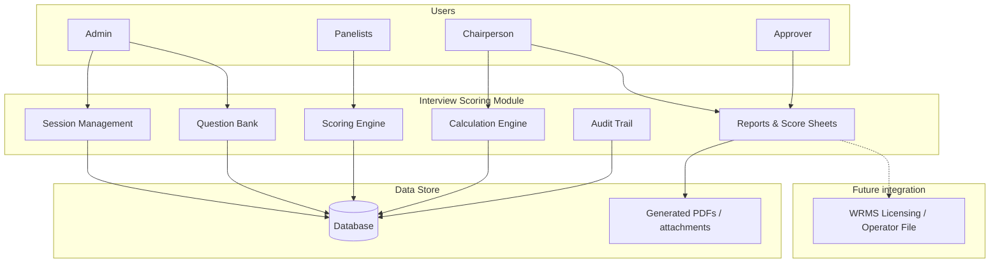
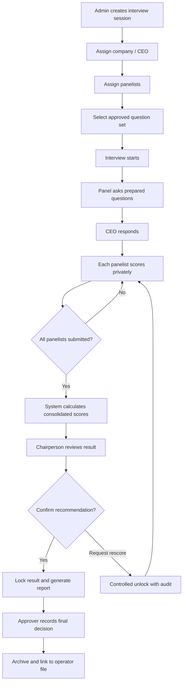
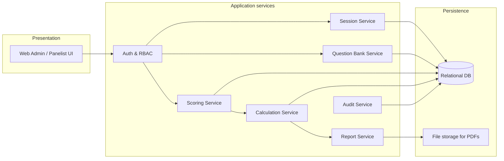
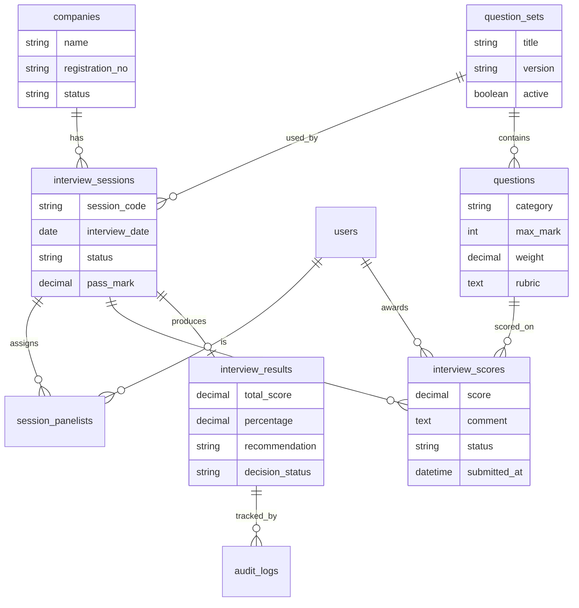
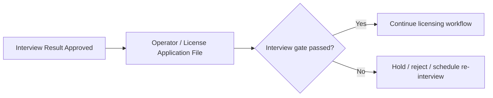

# WRRB Warehouse Operator Interview Scoring System

**Concept & Design Document**  
**Organisation:** Warehouse Receipt Regulatory Board (WRRB)  
**Version:** 1.0  
**Date:** August 2026  
**Status:** Concept / Design for automation

---

## 1. Overview

### 1.1 Idea summary

WRRB conducts interview sessions for warehouse operators. A panel asks prepared questions. The company CEO (or nominated representative) responds. Each panelist assigns marks according to the response. The system should automate session management, private panelist scoring, fair result calculation, reporting, and audit trail—and later link results to licensing / operator compliance workflows.

### 1.2 Problem to solve

| Current challenge | Automation benefit |
|-------------------|--------------------|
| Paper score sheets are hard to consolidate | Instant average / totals |
| Panelist marks may be influenced by peers | Private scoring until submit |
| Incomplete or inconsistent marking | Mandatory scores + rubrics |
| Weak audit trail | Who scored what, when |
| Hard to link interview to license file | Digital result attached to operator record |

### 1.3 Goal

Deliver a **Panel Interview Scoring Module** that:

1. Manages interview sessions for warehouse operators  
2. Uses approved prepared question sets  
3. Allows panelists to score independently  
4. Calculates consolidated results fairly  
5. Produces score sheets and recommendation reports  
6. Keeps a full audit trail  
7. Can integrate later with WRMS licensing workflows  

### 1.4 Out of scope (Phase 1)

- AI auto-scoring of spoken answers  
- Full video/audio recording analysis  
- Replacing human panel judgment  

Phase 1 automates **process, scoring integrity, calculation, and records**—not the judgment itself.

---

## 2. Users and roles

| Role | Responsibility |
|------|----------------|
| **Admin** | Create sessions, manage question banks, assign panelists and templates |
| **Panelist** | Score interviewee responses privately; submit final scores |
| **Chairperson** | Review consolidated result; confirm / recommend final decision |
| **Approver** | Approve final interview outcome into licensing / compliance process |
| **Viewer / Auditor** | Read-only access to history and reports |

### 2.1 Access principles

- Panelists see only their own scores until all required panelists submit (or until chairperson review stage).  
- Chairperson sees consolidated results after submission.  
- Score changes after lock require approval and are audited.  

---

## 3. High-level architecture



### 3.1 Recommended placement

| Option | Recommendation |
|--------|----------------|
| Standalone MVP | Fast to pilot interview sessions |
| Module inside WRMS | Best long-term: interview result becomes a licensing gate |
| Linked to Training System later | Optional if interview is part of capacity / fitness checks |

**Recommendation:** Start as a focused module (or WRMS submodule), then integrate interview outcome into the operator/company application file.

---

## 4. Core business flow



---

## 5. Functional design

### 5.1 Session management

An **Interview Session** contains:

- Session code / reference  
- Company / warehouse operator  
- Interviewee (CEO or representative)  
- Date, time, venue (or online link)  
- Interview type (e.g. new operator, renewal, special review)  
- Assigned panelists  
- Selected question template  
- Pass mark / weighting rules  
- Status: Draft → Scheduled → In progress → Scoring → Under review → Completed → Cancelled  

### 5.2 Question bank

Questions are reusable and version-controlled.

Each question includes:

| Field | Purpose |
|-------|---------|
| Question text | What the panel asks |
| Category | e.g. Operations, Compliance, Quality, Integrity |
| Maximum mark | Score ceiling |
| Weight (optional) | If some questions count more |
| Scoring rubric | Guide for consistent marking |
| Active / inactive | Control which questions are used |
| Version | Preserve history when wording changes |

Suggested categories for warehouse operator CEOs:

1. Company knowledge and governance  
2. Warehouse operations awareness  
3. Licensing and compliance  
4. Quality and storage standards  
5. Record keeping and receipts  
6. Safety, integrity, and anti-fraud awareness  

### 5.3 Panelist scoring

For each question, each panelist records:

- Score awarded (0 to max)  
- Optional comment  
- Panelist identity  
- Timestamp  
- Submission status (draft / submitted)  

Rules:

1. All questions must be scored before submit.  
2. Private scoring until submit (no live peer visibility).  
3. After submit, scores are locked.  
4. Rescore only via chairperson/admin workflow with reason logged.  

### 5.4 Calculation engine

Supported calculations:

- Score per question per panelist  
- Average score per question across panelists  
- Category totals  
- Overall interview percentage  
- Pass / fail against configured pass mark  
- Optional weighted total  

Optional quality checks:

- Flag high variance when panelists differ beyond a threshold on the same question  
- Flag incomplete panels  

### 5.5 Decision and reporting

Outputs:

1. Individual panelist score sheet  
2. Consolidated interview score sheet  
3. Panel recommendation summary  
4. Final approved decision record  

Reports should be exportable (PDF) and archivable against the company/operator record.

---

## 6. Logical module design



---

## 7. Data design (entities)



### 7.1 Key entities

| Entity | Description |
|--------|-------------|
| **Company / Operator** | Warehouse operator organisation under interview |
| **Interviewee** | CEO or authorised respondent |
| **Interview Session** | One scheduled interview event |
| **Panelist Assignment** | Users assigned to score that session |
| **Question Set** | Approved template of prepared questions |
| **Question** | Single scored item with rubric and max mark |
| **Interview Score** | One panelist’s mark for one question |
| **Interview Result** | Consolidated outcome for the session |
| **Audit Log** | Immutable history of actions and changes |

---

## 8. Scoring design

### 8.1 Marking approach

Prefer **rubric-guided numeric scoring** over vague impressions.

Example for a question with max mark = 10:

| Level | Guide | Score band |
|-------|--------|------------|
| Excellent | Covers most expected points clearly | 8–10 |
| Good | Covers several key points | 5–7 |
| Fair | Mentions limited relevant points | 2–4 |
| Poor / none | Little or no relevant answer | 0–1 |

### 8.2 Consolidation formula (default)

For each question:

```text
Question Average = Sum of panelist scores for question / Number of submitted panelists
```

Overall:

```text
Total Score = Sum of Question Averages
Percentage  = (Total Score / Maximum Possible Score) × 100
```

If weights are used:

```text
Weighted Total = Sum (Question Average × Question Weight)
```

### 8.3 Recommendation bands (configurable)

| Percentage | Suggested recommendation |
|------------|---------------------------|
| ≥ Pass mark | Recommended / Proceed |
| Below pass mark | Not recommended / Further review |
| Borderline band (optional) | Conditional / re-interview |

Exact thresholds should be approved by WRRB management.

---

## 9. UI / screen design (conceptual)

### 9.1 Admin screens

1. Dashboard (upcoming interviews, pending reviews)  
2. Question bank management  
3. Create / edit interview session  
4. Assign panelists and company  
5. Session monitoring (who has submitted)  
6. Final results and exports  

### 9.2 Panelist screens

1. My assigned interviews  
2. Scoring form (question list + marks + comments)  
3. Submit confirmation  
4. My submitted score sheet (read-only after lock)  

### 9.3 Chairperson screens

1. Sessions awaiting review  
2. Consolidated score view  
3. Variance alerts  
4. Confirm recommendation / request rescore  
5. Generate final report  

### 9.4 Scoring form layout (panelist)

| # | Category | Question | Max | Score | Comment |
|---|----------|----------|-----|-------|---------|
| 1 | Compliance | ... | 10 | [ ] | [ ] |
| 2 | Operations | ... | 10 | [ ] | [ ] |
| … | … | … | … | … | … |
| | | **My total** | | auto | |

---

## 10. Security and integrity design

| Control | Design |
|---------|--------|
| Authentication | Login required for all roles |
| Authorisation | RBAC by role and session assignment |
| Private scoring | Hide peer scores during active scoring |
| Locking | Submitted scores immutable without controlled unlock |
| Audit | Log create, score, submit, unlock, approve, export |
| Non-repudiation | Store panelist identity and timestamps on every score |
| Data protection | Restrict company interview data to authorised staff |

---

## 11. Integration design (future)



Future integration points with WRMS:

- Attach interview result to warehouse operator application  
- Use interview pass as a prerequisite before board recommendation / license issuance  
- Show interview history on operator profile  

---

## 12. Reports and appendices evidence

### 12.1 Standard reports

1. Session attendance / panel register  
2. Individual panelist score sheet  
3. Consolidated score sheet  
4. Recommendation summary  
5. Audit extract for a session  

### 12.2 Design artefacts for documentation

| Artefact | Purpose |
|----------|---------|
| Context diagram | Who uses the module |
| Process flowchart | Interview-to-decision flow |
| ER diagram | Data structure |
| Role matrix | Access control |
| Sample score sheet | Operational template |

---

## 13. Implementation roadmap

### Phase 1 — MVP (pilot)

- Session create / assign  
- Question set + scoring form  
- Private panelist scoring  
- Auto average and total  
- PDF consolidated score sheet  
- Basic audit log  

### Phase 2 — Quality and control

- Rubrics on each question  
- Variance alerts  
- Chairperson confirmation workflow  
- Controlled rescore  
- Stronger reporting  

### Phase 3 — Enterprise integration

- Link to WRMS operator/licensing file  
- Interview as compliance gate  
- Analytics (weak categories, pass rates)  
- Optional offline / mobile scoring  

---

## 14. Success criteria

| Criterion | Target |
|-----------|--------|
| All panelists submit digital scores | 100% of completed sessions |
| Result calculation time | Immediate after last submission |
| Score integrity | Locked after submit; changes audited |
| Traceability | Full who/when/what history per session |
| Usability | Panelist can complete scoring without paper |
| Decision support | Chairperson can confirm based on consolidated sheet |

---

## 15. Risks and mitigations

| Risk | Mitigation |
|------|------------|
| Panelist bias | Private scoring + averaging + variance flags |
| Inconsistent marking | Rubrics and training for panelists |
| Incomplete scores | Block submit until all questions scored |
| Late panelist | Session monitoring and reminders |
| Dispute on result | Audit trail + chairperson review |
| Over-automation too early | No AI marking in Phase 1 |

---

## 16. Recommended next steps

1. Confirm interview types and pass mark policy with WRRB management.  
2. Draft the first approved question set for warehouse operator CEO interviews.  
3. Approve scoring rubrics per question category.  
4. Validate roles (Admin, Panelist, Chairperson, Approver).  
5. Build Phase 1 MVP and pilot on a small number of real sessions.  
6. After pilot, integrate result into WRMS operator licensing file.  

---

## 17. Design summary

```text
Interview Session
   + Question Set (prepared questions + rubrics)
   + Panelists (private marks)
   + Calculation Engine (average / total / pass)
   + Chairperson Review
   + Approved Result + Audit Trail
   (+ later) WRMS Licensing Gate
```

This design makes the WRRB operator interview process ready for automation while keeping human professional judgment at the centre of scoring.

---

## Document control

| Item | Detail |
|------|--------|
| Title | WRRB Warehouse Operator Interview Scoring System – Concept & Design |
| Related systems | WRMS, WRRB ICT operations |
| Audience | WRRB management, ICT, licensing / compliance teams |
| Next artefact | Question bank draft + sample consolidated score sheet |
